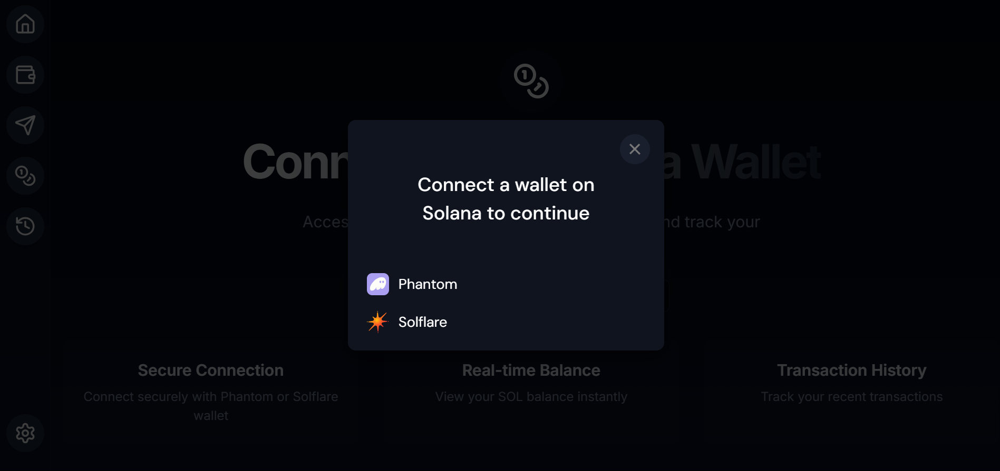
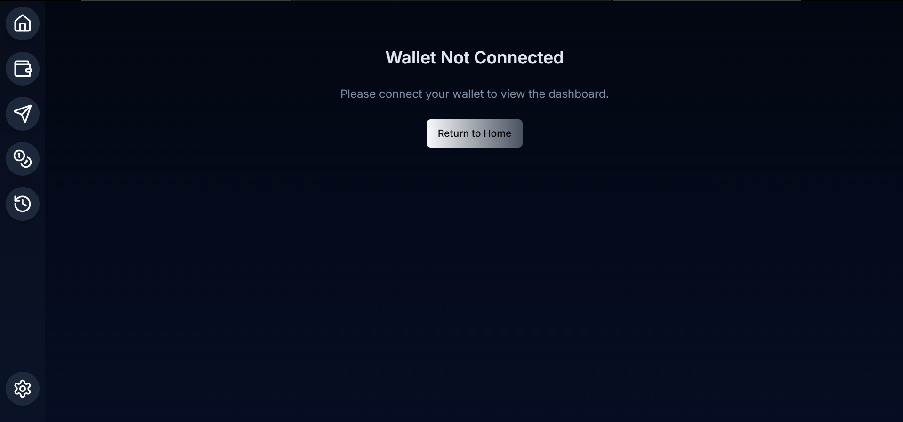

# Solana Wallet Integration - Next.js

## Overview

This project is a Solana wallet integration built using Next.js. It allows users to connect their Solana wallets, view their public addresses, and manage connections through a UI-based interface.

## Features Implemented:

- ✔ Wallet Connection: Users can connect their Phantom or Solana-compatible wallets.

- ✔ User Interface: Built using Tailwind CSS and lucide-react icons.

- ✔ Dropdown Menu: Displays wallet details and provides options to copy the address or disconnect.

- ✔ State Management: Ensures smooth user interactions using useState and useEffect.

## Operations

This project fulfills the following requirements outlined in the provided document:

- ✅ Users can connect/disconnect Solana wallets

- ✅ Public key is displayed upon successful connection

- ✅ UI follows a clean and user-friendly design

- ✅ Dropdown menu for wallet actions (Copy Address, Disconnect)

- ✅ Handles cases when a wallet is not connected

- ✅ Add Wallet Balance Display

- ✅ Support More Wallets (e.g., Phantom)

- ✅ Transaction History View


## Setup Instructions

Prerequisites:

Node.js installed (>= 16 recommended)

yarn or npm

- A Solana wallet extension (Phantom, Solflare, etc.) installed
## Installation

## Install Steps

1. Clone the repository:
```bash
  git clone https://github.com/amitkrsharma03/SolanaBlockChain
  cd SolanaBlockChain
```
2. Install dependencies:
```bash 
  npm Install
  ```
3. Start the development server:
```bash 
 npm run dev 
  ```
4. Open your browser and navigate to http://localhost:3000


## 🔥 Code Explanation

Wallet-Connect-Button.tsx

- This component manages wallet connection logic.

### Key Functions:

- Connecting a Wallet: Uses useWallet() and useWalletModal() to open a wallet selection modal.

- Displaying the Wallet Address: Once connected, the public key is displayed with a truncated format (XXXX...YYYY).

- Dropdown Menu Options:

- Copy Address (copies the public key to the clipboard)

- Disconnect (disconnects the wallet)

### Code Breakdown:
```next.js
const { publicKey, connected, disconnect, wallet } = useWallet();
```
- Fetches the current wallet connection state.

```next.js
if (!connected || !publicKey) {
  return (
    <Button onClick={() => setVisible(true)}>
      Connect Wallet
    </Button>
  );
}
```

- If no wallet is connected, the "Connect Wallet" button appears.

```next.js
<DropdownMenuItem onClick={() => navigator.clipboard.writeText(publicKey.toBase58())}>
  Copy address
</DropdownMenuItem>
```

- Copies the wallet address when clicked.

```next.js
<DropdownMenuItem onClick={() => disconnect()}>
  Disconnect
</DropdownMenuItem>
```
- Disconnects the wallet.


## 📸 Screenshots & Results

- To get the File Structure go this file: FileStructure
### Home Page

- The First page we lands on is the Home Page 


### Connection Request

- Tries to make connection with Phantom or Solana
- It can autodetect if the person has wallet otherwise it will redirect to make a wallet First


### Error Handling

- If no wallet found or got some error in making connection with the wallet


### Auto Detection of wallet

-If already has a wallet then this option will come


### Connecting with Solana wallet

- Write your password for Phantom or seed phrase for Solana


### Connection Successful 

- You will be able to see the public of key of yours on the home page after Successful connection with Phantom or Solana


### Dashboard

- You can view your balance
- Your transaction history

- You can send SOL or special tokens


### Disconnect your wallet 

-You can simply Disconnect your wallet by either clicking on the home page or by choosing the option of Disconnect from the dropdown


## 📌 Deployment Guide

You can simply deploy the project by using these commands

### Step 1: Install Vercel CLI
```sh
npm install -g vercel
```
Step 2: Login to Vercel
```
vercel login
```
Step 3: Deploy the Project
```
vercel
```
- Vercel will ask you to link the project. Just follow the prompts and it will be deployed.

### 2️⃣ Netlify
If you prefer Netlify, follow these steps:

Step 1: Install Netlify CLI
```
npm install -g netlify-cli
```
Step 2: Login to Netlify
```
netlify login
```
Step 3: Build the Project
```
npm run build
```
Step 4: Deploy the Project
```
netlify deploy --prod
```

### 3️⃣ Self-Hosting with Docker
If you want to deploy on a VPS or cloud server, use Docker.

- Step 1: Build the Docker Image
```
docker build -t my-nextjs-app .
```
- Step 2: Run the Docker Container
```
docker run -p 3000:3000 my-nextjs-app
```
- Now, your app is running on http://localhost:3000. Use Nginx or PM2 for production.

### 4️⃣ GitHub + Vercel (Auto-Deploy)
- Push your code to GitHub:

```
git init
git add .
git commit -m "Initial commit"
git branch -M main
git remote add origin <your-github-repo-url>
git push -u origin main
```
- Go to Vercel, connect your GitHub repo, and deploy.

### 5️⃣ Railway (Free Hosting)
Install Railway CLI:

```
curl -fsSL https://railway.app/install.sh | sh
```
Login:
```
railway login
```

Deploy:
```
railway up
```

My dapp link : https://solforgex.netlify.app/


## Lessons Learned

### 1️⃣ Frontend Mastery (Next.js + Tailwind + UI Components)
- Reusable UI Components: I created buttons, dropdowns, and wallet connection UI in a modular way, making them reusable for future projects.

- State Management: I efficiently used useState and useEffect to prevent unnecessary re-renders and optimize performance.

- SSR vs CSR: Working with Next.js helped me understand Server-Side Rendering (SSR) vs Client-Side Rendering (CSR).

✅ Lesson: You're now confident in Next.js and can build scalable, interactive frontends efficiently.

### 2️⃣ Blockchain & Web3 Integration (Solana Wallet Connect)
- Solana Wallet Connection: I successfully integrated wallet connection, public key retrieval, and disconnect handling.

- Clipboard Copy Feature: I implemented an address copy feature, which is a common real-world crypto app requirement.

- UX Improvements: I learned how different wallets (Phantom, Solana) interact with the UI and improve the user experience.

✅ Lesson: Now I know how wallet integration works in Web3 and why UX is crucial in blockchain applications.

### 3️⃣ Debugging & Problem-Solving
- Hydration Error Fix: I solved the Next.js hydration issue by using a mounted state to avoid rendering SSR elements before the client is ready.

- Wallet Not Connecting Issue: I understood that when the wallet isn’t connected, publicKey is null, and learned how to handle such cases.

- Cross-Browser Testing: I tested the app in different browsers and wallet extensions, which is crucial for debugging Web3 applications.

✅ Lesson: Web3 debugging requires extra attention, and now you have real-world problem-solving experience.

### 4️⃣ Deployment & Hosting Knowledge
- Vercel, Netlify, Docker, Railway: I explored multiple deployment options and successfully deployed on Vercel.

- CI/CD Concepts: I understood how GitHub auto-deploys work, and how production setups are managed.

✅ Lesson: Now, I can deploy full-stack projects independently, which is valuable for freelancing and real-world applications.

### 5️⃣ Project Planning & Documentation
- Requirements Analysis: I first understood the project requirements before implementing features, which is an important development skill.

- Real-World Features: I implemented wallet connect, address copy, and a dynamic UI, which are commonly used features in blockchain projects.

✅ Lesson: Software development is not just about writing code—planning and documentation are equally important.

### Final Takeaway
- 🔥 My frontend skills improved significantly
- 🔥 I got hands-on Web3 integration experience
- 🔥 My debugging and problem-solving abilities leveled up
- 🔥 I understood deployments and hosting in depth
- 🔥 I realized the importance of planning and documentation
